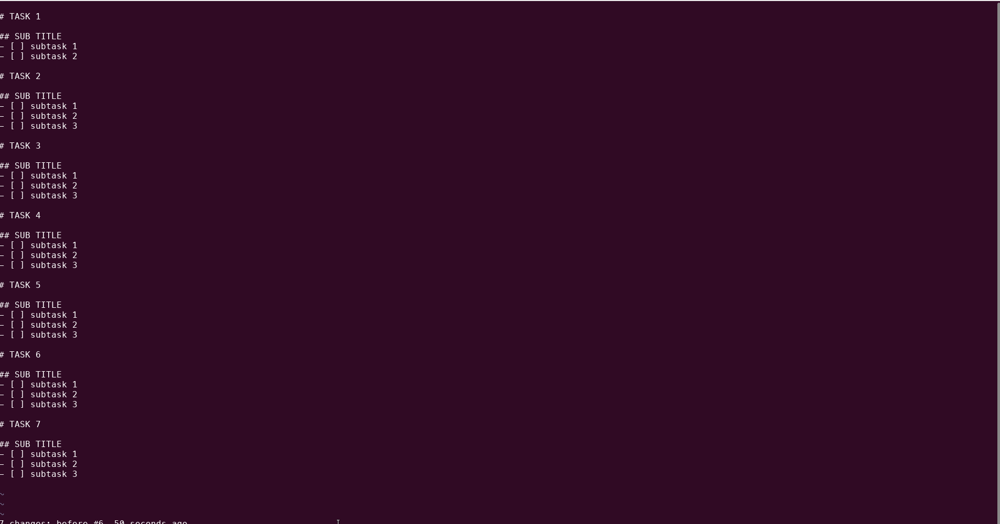

# append-random-name-to-markdown-title-vim-plugin
> vim plugin to append random names from a list to all markdown titles

## Installation
<details>
<summary>without plugin manager</summary>

1. In the terminal,
    ```bash
    mkdir -p ~/.vim/bundle/
    git clone https://github.com/roymanigley/append-random-name-to-markdown-title-vim-plugin.git ~/.vim/bundle/append-random-name-to-markdown-title-vim-plugin
    mkdir -p ~/.vim/plugin/
    ln -s ~/.vim/bundle/append-random-name-to-markdown-title-vim-plugin/plugin/simple_template.vim ~/.vim/plugin/simple_template.vim
    ```
1. Restart Vim
</details>


<details>
<summary>Pathogen</summary>
Pathogen is more of a runtime path manager than a plugin manager. You must clone the plugins' repositories yourself to a specific location, and Pathogen makes sure they are available in Vim.


1. In the terminal,
    ```bash
    git clone https://github.com/roymanigley/append-random-name-to-markdown-title-vim-plugin.git ~/.vim/bundle/.append-random-name-to-markdown-title-vim-plugin
    ```
1. In your `vimrc`,
    ```vim
    call pathogen#infect()
    syntax on
    filetype plugin indent on
    ```
1. Restart Vim
</details>

<details>
  <summary>Vundle</summary>

1. Install Vundle, according to its instructions.
1. Add the following text to your `vimrc`.
    ```vim
    call vundle#begin()
      Plugin 'roymanigley/append-random-name-to-markdown-title-vim-plugin'
    call vundle#end()
    ```
1. Restart Vim, and run the `:PluginInstall` statement to install your plugins.
</details>

<details>
  <summary>Vim-Plug</summary>

1. Install Vim-Plug, according to its instructions.
1. Add the following text to your `vimrc`.
```vim
call plug#begin()
  Plug 'roymanigley/append-random-name-to-markdown-title-vim-plugin'
call plug#end()
```
1. Restart Vim, and run the `:PlugInstall` statement to install your plugins.
</details>

<details>
  <summary>Dein</summary>

1. Install Dein, according to its instructions.
1. Add the following text to your `vimrc`.
    ```vim
    call dein#begin()
      call dein#add('roymanigley/append-random-name-to-markdown-title-vim-plugin')
    call dein#end()
    ```
1. Restart Vim, and run the `:call dein#install()` statement to install your plugins.
</details>

## Example usage

> add this to your `.vimrc` file to define the names  


    let g:names=["Alpha", "Beta", "Gamma", "Delta"]

> add this to your `.vimrc` file to use it as a shortcut  

    nnoremap <C-t> :call RandomMarkdownAppender#randomizeSimple()<CR>

    " API_KEY_REQUIRED for RandomMarkdownAppender#randomizeRandomDotOrg
    " export RANDOM_DOT_ORG_API_KEY=***************************
    nnoremap <C-P> :call RandomMarkdownAppender#randomizeRandomDotOrg()<CR>


